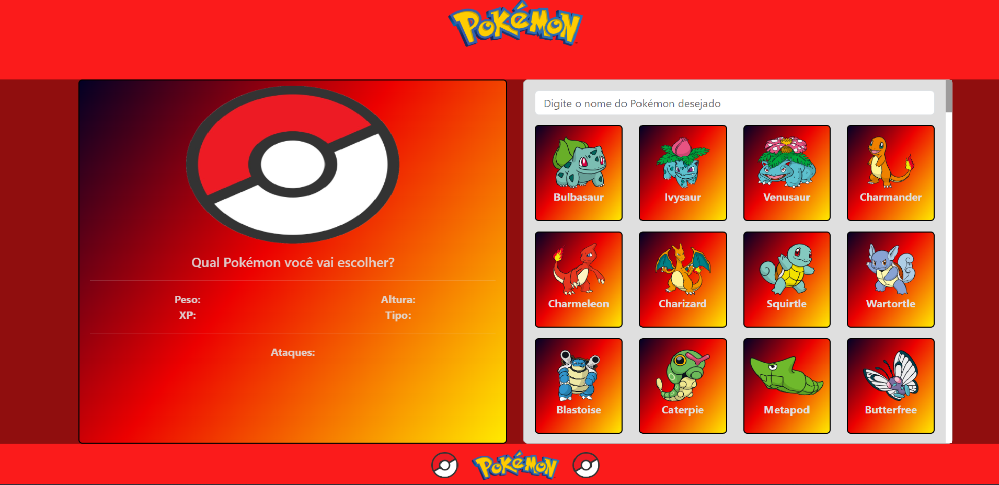

<h1 align="center"> Pokédex</h1>

## 💻 Projeto
Projeto desenvolvido afim de aprimorar e conhecer novos conceitos do VueJs.

Para acessar o projeto, [clique aqui](https://hugopokedex.netlify.app/)!

    

## 🚀 Tecnologias
Esse projeto foi desenvolvido com as seguintes tecnologias:
HTML          
CSS        
Bootstrap         
JavaScript            
VueJs

## API Utilizada
https://pokeapi.co/
## Referências
https://www.youtube.com/@yurimarcon                                        
## Outros
https://cssgradient.io/                      
https://animate.style/
https://www.youtube.com/watch?v=c3bCLkcsUHo
